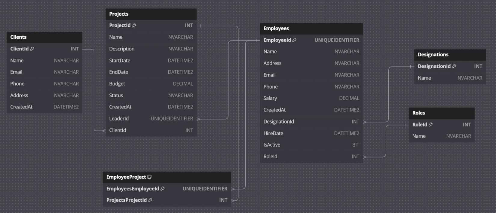

# Employee Management System API

This is the backend API for the Employee Management System. It is built using ASP.NET Core and provides CRUD operations for managing employees, roles, designations, clients, and projects. The API supports secure login and logout functionality using local storage and guards unauthorized access to endpoints.

---

## Table of Contents
- [Features](#features)
- [Technologies Used](#technologies-used)
- [How to Run the Project](#how-to-run-the-project)
  - [Prerequisites](#prerequisites)
  - [Steps to Run the Project](#steps-to-run-the-project)
- [Database Schema](#database-schema)
- [API Endpoints](#api-endpoints)
- [License](#license)

---
## 🔗 **Related Repository**

This backend works with the frontend project, built in **Angular**. Find it [here](https://github.com/Nourhan123Essam/Employee-Management-System-Angular).
---

## Features
- CRUD operations for `Role`, `Designation`, `Employee`, `Client`, and `Project` entities.
- Relationships between entities:
  - Each project has a lead employee and a related client.
  - Each employee has a role and designation.
  - Employees can work on multiple projects, but only one employee is the lead for a project.
- Authentication using local storage.
- Guards implemented to prevent unauthorized access to endpoints.
- AutoMapper used for mapping between models and DTOs.

---

## Technologies Used
- **Backend**: ASP.NET Core 6, AutoMapper
- **Database**: SQL Server
- **Tools**: Entity Framework Core, Swagger
- **Authentication**: Local storage for login/logout

---

## 🗃️ **Database Schema**

Here is the schema for the database showing the relationships between entities:  

  

---

## 📖 **Endpoints**

Below is a Screenshots of the endpoints exposed by this API.  
1- (Employee-System-Backend/Project Screens/Swagger Ui 1.png)
2- (Employee-System-Backend/Project Screens/Swagger Ui 2.png)
3- (Employee-System-Backend/Project Screens/Swagger Ui 3.png)
4- (Employee-System-Backend/Project Screens/Swagger Ui 4.png)


---

## How to Run the Project

### Prerequisites
Ensure you have the following installed:
- [.NET SDK](https://dotnet.microsoft.com/download) (version 6.0 or later)
- SQL Server
- Visual Studio or any preferred IDE
- Postman or similar API testing tools (optional)

---

## 💡 **How to Run**

### Steps:
1. Clone the repository:  
   
    ```bash
     git clone https://github.com/Nourhan123Essam/Employee-Management-System-API-ASP.Net.git

2. Update the appsettings.json with your SQL Server connection string in this format:
  in the appsetting.json put your database name, and server name in the DefaultConnection:
    
    ```appsetting.json
    "ConnectionStrings": {
    "DefaultConnection": "Server=your-server-name;Database=your-database-name;Trusted_Connection=True;TrustServerCertificate=True"
    }
3.Apply Migrations
 - Open the terminal and navigate to the project folder where the .csproj file is located.
 - Run the following command to create the database and apply migrations:
    ```bash
      dotnet ef database update
  
4. Open the the folder using Visual Studio then run the project

###📬 Let's Connect
- [LinkedIn](https://www.linkedin.com/in/nourhan-essam123/)  
- [LeetCode](https://leetcode.com/u/norhan123/)  
- [GitHub](https://github.com/Nourhan123Essam)
- [Gmail](nourhan.essam.makhlouf@gmail.com)
---
